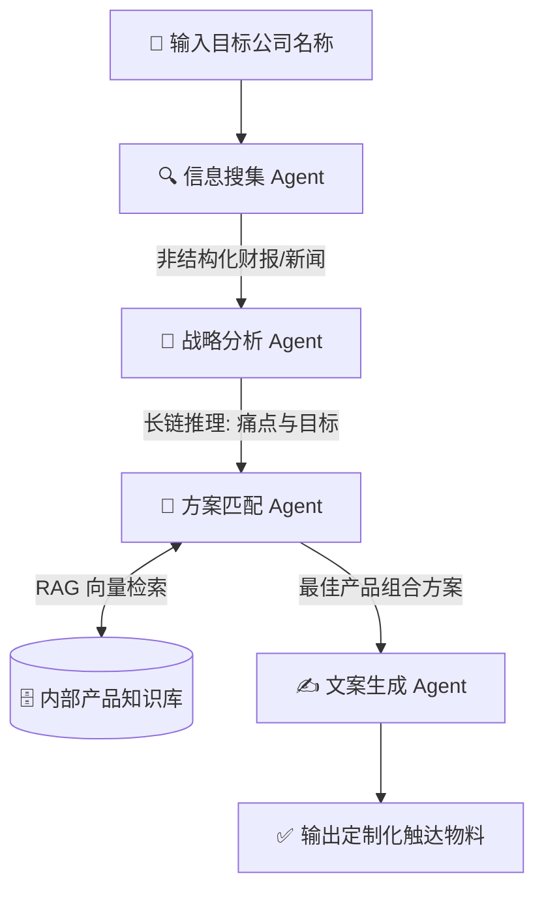

<div align="center">

# 🤖 AutoB2B-Agent
**基于多智能体（Multi-Agent）与长链推理的 B2B 企业自动化深度调研与方案生成引擎**

[](https://opensource.org/licenses/MIT)
[](https://www.python.org/)
[]()
[]()

</div>

---

> **AutoB2B-Agent** 致力于打破 B2B 销售团队的效率瓶颈。通过大模型的长链推理（Long-chain Reasoning）能力与多 Agent 协同，实现从“全网信息挖掘”到“定制化触达方案”的全自动闭环。

## 🎯 业务价值与落地成果

本项目目前已在核心销售与 BD 团队（约 50 人规模）内部落地运行，并取得以下量化成果：

*   ⚡ **极致提效**：将单次大客户深度调研与方案准备时间，从平均 **4 小时压缩至 3 分钟以内**。
*   📈 **高转化率**：基于 RAG 的精准痛点匹配，高优商机的转化率绝对提升约 **35%**。
*   🛡️ **高可用性**：系统具备高并发处理能力，每日稳定消耗约 **800 万 Token**，无缝衔接现有 CRM 业务流。

---

## ⚙️ 核心架构流 (Architecture)

系统采用顺序编排（Sequential Process）机制，确保上游 Agent 的推理结果严格作为下游 Agent 的上下文输入。



---

## 🤖 智能体矩阵 (Agent Swarm)

| Agent 角色 | 核心能力 (Capabilities) | 挂载工具 (Tools) | 输出工件 (Artifacts) |
| :--- | :--- | :--- | :--- |
| **🔍 情报调查员** | 全网数据爬取、降噪、信息聚合 | `TavilySearch`, `WebScraper` | 目标企业深度背景调查报告 |
| **🧠 战略分析师** | 长链逻辑推理、商业洞察、痛点提取 | `None` (纯推理引擎) | 客户核心痛点与战略目标剖析 |
| **🧩 方案架构师** | RAG 知识检索、价值主张匹配 | `VectorDB_Retriever` | 产品映射矩阵与初步报价单 |
| **✍️ 营销文案专家** | 客户导向写作、高转化率话术生成 | `None` | Cold Email 文本 & Pitch Deck 大纲 |

---

## 🚀 快速开始 (Quick Start)

### 1. 环境准备
建议使用 `python 3.9+`，并推荐使用虚拟环境：
```bash
git clone https://github.com/yourusername/AutoB2B-Agent.git
cd AutoB2B-Agent
python -m venv venv
source venv/bin/activate  # Windows 用户使用 venv\Scripts\activate
pip install -r requirements.txt
```

### 2. 环境配置
复制环境变量模板，并填入您的 API 密钥：
```bash
cp .env.example .env
```
修改 `.env` 文件：
```env
OPENAI_API_KEY="sk-xxxxxxxxxxxxxxxxxxxxxx"
TAVILY_API_KEY="tvly-xxxxxxxxxxxxxxxxxxxxxx"
```

### 3. 启动引擎
```bash
python main.py
```

---

## 💻 运行效果展示 (Console Output)

```console
$ python main.py
[AutoB2B-Agent] 🚀 系统初始化完成。
请输入需要攻克的 B2B 目标客户名称: 某某科技集团

[Agent: 资深商业情报调查员] 正在调用【互联网深度搜索工具】...
✅ 获取到最新财报数据与高管专访记录。

[Agent: 首席商业战略分析师] 正在进行长链推理...
💡 发现核心痛点：随着业务出海，现有本地机房架构导致合规风险飙升，且运维成本环比增长 20%。

[Agent: 产品解决方案架构师] 正在交叉比对【我方产品向量知识库】...
🔗 匹配成功：推荐组合【CloudShield 云原生安全套件】+【跨海专线服务】。

[Agent: B2B 顶尖营销文案专家] 正在生成最终触达物料...
🎉 任务完成！耗时: 45.2s

================ OUTPUT ================
主题：关于【某某科技集团】出海合规与降本增效的探讨...
(此处省略生成的极具说服力的邮件正文与 PPT 大纲)
========================================
```

---

## 🛠️ 技术栈 (Tech Stack)
*   **编排框架**: CrewAI, LangChain
*   **LLM 引擎**: OpenAI `gpt-4o`, `gpt-3.5-turbo` (Fallback)
*   **向量检索**: Pydantic, ChromaDB
*   **数据解析**: BeautifulSoup4, PyYAML

## 📜 开源协议
本项目基于 [MIT License](LICENSE) 开源。欢迎提交 PR 和 Issue！
```
